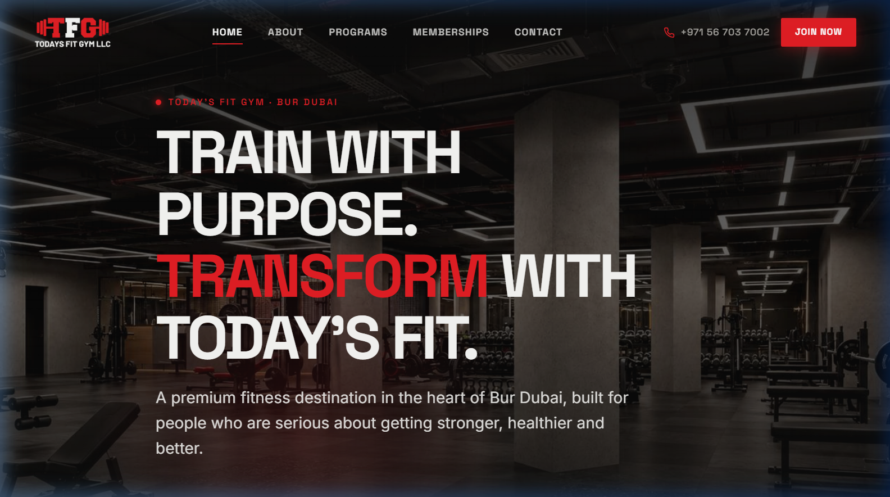
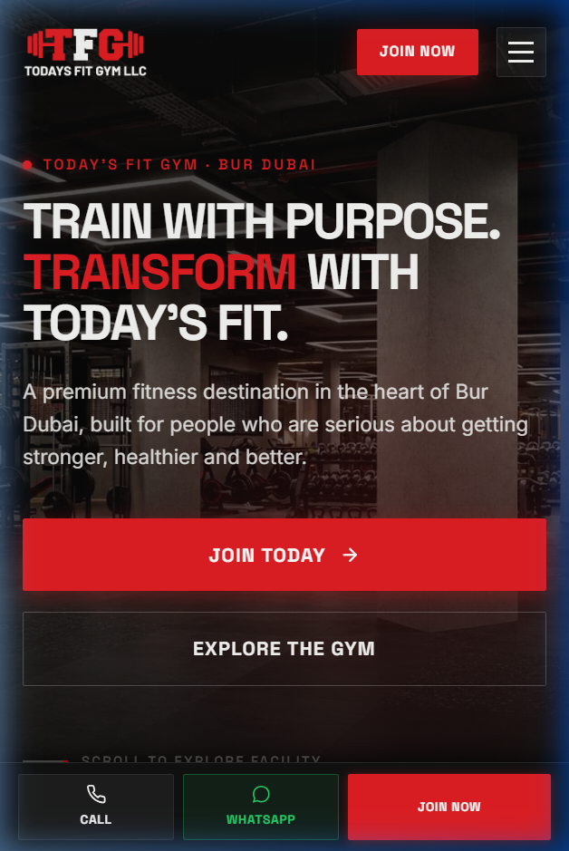

# Today's Fit Gym LLC — Official Website

## Live Link
- **Production Domain**: [https://todaysfitgym.com](https://todaysfitgym.com)
- **Google Maps Listing**: [Today's Fit Gym on Google Maps](https://maps.app.goo.gl/y8bzJLqmvyBBq5va6?g_st=iw)

---

## Preview



<p align="center">
  
</p>

---

## Project Description

A production-quality, 5-page commercial website engineered for **Today's Fit Gym LLC**, located in the historic core of Bur Dubai, Dubai, UAE (1st Floor, Mohebi Centre Building, Al Fahidi Street, opposite Astoria Hotel).

Built with an **"Industrial Luxury Fitness"** design system inspired by the club's physical interior design: raw warm concrete textures, charcoal fitness surfaces, black metal framing, warm oak architectural finishes, subtle muted rose accents, and high-contrast editorial typography. Designed to deliver high conversion rates for membership enquiries, phone consultations, WhatsApp tours, and physical visits while meeting strict performance, accessibility, and local Dubai SEO standards.

---

## Tech Stack

- **Markup**: Semantic HTML5 with Schema.org `ExerciseGym` JSON-LD structured data
- **Styling**: Vanilla CSS3 Custom Design System (CSS custom properties, fluid typography with `clamp()`, GPU-accelerated motion with `transform: translate3d()`)
- **Typography**: Google Fonts (`Space Grotesk` for display headings, `Inter` for body & navigation)
- **Scripting**: Modern Vanilla ES6+ JavaScript (zero external runtime dependencies, lightweight, sub-second initial render)
- **Imagery**: WebP optimized graphics with responsive dimensions and explicit aspect ratios
- **Tooling**: Python asset extraction pipeline (`PyMuPDF`, `Pillow`)

---

## Key Features

- **Cinematic Full-Screen Hero & Architectural Marquee**: High-impact editorial headline reveal, authentic gym floor backdrop, scroll indicator, and subtle marquee ticker.
- **Authentic Gym Interior Showcase**: Seamless integration of 9 genuine 3D interior design renders (Reception, In-House Café, Executive Member Lounge, Main Strength Floor, Spin Zone, Power Racks, and Cable Jungle).
- **Interactive Lightbox Gallery**: Custom keyboard-navigable modal viewer with full-screen zoom, smooth transitions, and accessibility attributes.
- **Conversion-Optimized Membership Matrix**: Dedicated pricing cards for 1, 3, 6, and 12-month memberships featuring verified pricing, highlighted 12-month "Best Value" plan, membership freezing allowances, and transparent feature breakdown.
- **Instant WhatsApp & Phone Integrations**: Direct pre-filled WhatsApp enquiry routing (`+971 56 703 7002`) and clickable telephone links across all pages and modals.
- **Sticky Mobile Action Bar**: Fixed bottom quick-action utility bar on mobile screens (`[ CALL ]` · `[ WHATSAPP ]` · `[ JOIN NOW ]`) for frictionless mobile booking.
- **Interactive Modals & Toast System**: Accessible "Join Now" and "Book A Visit" dialogs with instant client-side validation and toast notifications.
- **FAQ Accordion**: Smooth expand/collapse accordion addressing common questions regarding ladies & gents privacy zones, sauna facilities, and freezing terms.
- **Dubai Local SEO & Accessibility**: Handcrafted metadata, Open Graph cards, Google Maps embed, WCAG contrast compliance, and `prefers-reduced-motion` support.

---

## Page Structure

1. **Home (`index.html`)**: Cinematic hero, brand statement, factual quick stats, service teaser, 4 pillars, interactive facility gallery, amenities showcase, membership teaser, location card, and final CTA.
2. **About (`about.html`)**: Club vision, training approach, four pillars, architectural space breakdown, and goal categories.
3. **Programs (`programs.html`)**: Featured Personal Training modules spotlight, 8-service directory (Strength, Cardio, Weight Loss, Muscle Building, Nutrition, Karate, Dance), and 5-step training roadmap.
4. **Memberships (`memberships.html`)**: 4 verified membership pricing tiers (AED 180 to AED 1260), plan comparison table, value propositions, and interactive FAQ accordion.
5. **Contact (`contact.html`)**: Detailed physical address, interactive Google Maps embed, direct call and WhatsApp buttons, and interactive enquiry form with WhatsApp integration.

---

## Local Setup / Run Instructions

To preview or run the website locally without any installation of heavy frameworks:

```bash
# Clone the repository
git clone https://github.com/favazmk/todaysfit-gym.git

# Navigate into the project folder
cd todaysfit-gym

# Start a local static HTTP server (choose any option below):

# Option A: Python 3
python -m http.server 8080

# Option B: Node.js (npx serve)
npx serve .

# Open in your browser:
# http://localhost:8080
```

---

## Business Information

- **Business Name**: Today's Fit Gym LLC
- **Physical Address**: 1st Floor, Mohebi Centre Building, Al Fahidi Street, Opposite Astoria Hotel, Bur Dubai, Al Fahidi, Dubai, United Arab Emirates
- **Phone**: [+971 56 703 7002](tel:+971567037002)
- **WhatsApp**: [+971 56 703 7002](https://wa.me/971567037002)
- **Domain**: [todaysfitgym.com](https://todaysfitgym.com)
